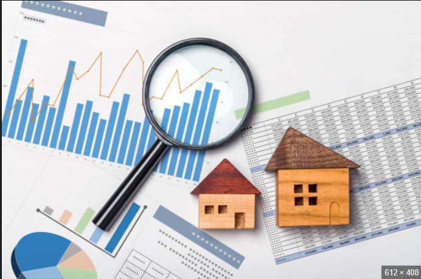

# REAL ESTATE ANALYSIS

## INTRODUCTION

Real estate is defined as the land and any permanent structures, like a home, or improvements attached to the land, whether natural or man-made. Real estate is a form of real property. It differs from personal property which is not permanently attached to the land such as vehicles, boats jewelry, furniture and farm equipment. There are five main categories of real estate which include residential, commercial, industrial, raw land and special use. Investing in real estate includes purchasing a home, rental property or land.

The real estate market refers to the buying and selling of properties, including land and buildings. The real estate market is cyclical and can be influenced by many factors such as interest rates, economic conditions, government policies, and demographics1.

The real estate market can be influenced by many factors such as interest rates, economic conditions, government policies, and demographics. Interest rates can affect the cost of borrowing money to purchase a home or property. When interest rates are low, it can make it easier for people to buy homes or properties. Economic conditions such as employment rates and consumer confidence can also impact the real estate market. Government policies such as tax incentives for homebuyers or zoning regulations can also affect the real estate market. Demographics such as population growth and migration patterns can also influence the real estate market.

Some factors that can affect the price of a property are:
    1. Prices of comparable properties
    2. The neighborhood
    3. The home's age and condition
    4. Property size
    5. The state of the housing market

## PROBLEM STATEMENT

A real estate company has a dataset(King County House Sales Dataset) which contains the prices of properties. It wishes to use the data to optimize the recommendations they can make to buyers or sellers. The project aims to provide a deeper insight on the factors affecting the prices of property in the area.

## OBJECTIVES

- Main Objective
    - To understand various features that affect the price of a house.

- Specific Objectives
    - To build a multiple linear regression model that will help us identify how different factors affect the price of a property.
    - Identify which factors have the most positive influence and which have negative influence on the price of the house.
    - Provide information to buyers, sellers and contractors(all clients)

## DATA AVAILABLE
We have been provided with data from king county house sales dataset.
* [kc_house_data.csv]

### NOTEBOOK STRUCTURE
- Importing libraries
- Reading the data
- Data preparation
- Exploratory Data Analysis
- Conclusions
- Recommendations

## METHODOLGY
### Data preparation

Data provided wasn't clean so we had to perform some cleaning where some rows had null values were replaced, some columns were also dropped. Some of the data type wasn't in the desired format so we had to change them using the appropriate formats. Some columns were encoded.

### EDA

We performed various calculations with the data inorder to have a meaningful outcome. We then proceeded to build a total of 5 models with the last model being more accurate statistically than all the other models. We drew our last conclusions from the last model(model_5)

## CONCLUSION

- The variables with the highest positive impact on the price of a house are water_front and grade_levels of the property.

- The variables with mid level positive impact on the price of a property are bathrooms, view, condition and renovation status.

- The variables with lowest positive impact on the price are sqft_living and age.

- The variables with a negative impact on the price of a property are:
    - sqft_basement
    - bedrooms
    - distance

## RECOMMENDATIONS

- The real estate will advise sellers to renovate their properties before putting them in the market as it will increase the relative price of the property.
- The real estate agency would advise buyers of properties on the market depending on the budget of the buyers the factors that affect price of a property hence be able to effectively deliver their best services to the buyers. For Example: If a buyer wants to buy a property on the waterfront the real estate agency would a advise the client that a property on the waterfront will likely to have a higher price than that which is not located at the waterfront. This will be applied widely depending on what the client wants or doesnt want.
- The real estate will advise contractors and clients on how different types of properties perform in the real estate market hence one can select a property type which is likely to be more profitable in the market as real estate is all about profit margins. For example the agency might suggest to the contractor/client to build a higher grade_level property such as a mansion and also near the waterfront as these will boost the price of the property hence making it more profitable.

## Non Technical Presentation

[Google Slides](https://docs.google.com/presentation/d/18gQ9uZVo_NLe0KdGMemzYkbL-HBMtzh9v0jHBvrA-QQ/edit#slide=id.g25842cb23ad_0_225)